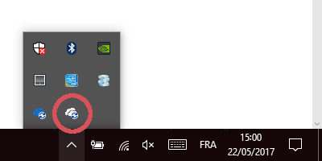

# Kaufman & Broad : guide d'utilisation du Compositeur Digital

Ce guide décrit comment utiliser le Compositeur Digital sur les tables, tablettes ou écran tactiles pour présenter les programmme Kaufman & Broad.

## Lancer et utiliser le Compositeur Digital

- Si le Compositeur digital n'est pas déjà lancé, une icône Compositeur Digital doit se trouver sur le bureau :

- Pour utiliser le Compositeur Digital, référez-vous à la [documentation en ligne](use.md).

## Dépannage

### Lorsque je charge un programme, le Compositeur Digital indique "Préparation des contenus" pendant plusieurs minutes.

Les contenus sont préparés lors de la première ouverture du programme pour être ensuite disponible instantanément. C'est pourquoi il est conseillé de charger un programme en avance de toute présentation à un client.

### Il manque un ou plusieurs programme, ou le programme n'est pas complet.

Les contenus ne sont pas synchronisés ou ne le sont que partiellement. Veuillez suivre les étapes suivantes pour tenter de résoudre les problème.

1. Quitter le Compositeur Digital s'il est en cours d'éxecution.
2. Verifier la connexion à internet dans la barre de tâches :

- Si la tablette ou l'écran n'est pas connecté :

- Appuyez l'icône Wi-Fi et choisissez le réseau

3. Vérifiez la synchronisation OneDrive :
- Si l'icône indique une synchronisation en cours 

- patientez jusquà ce que l'icône passe en état synchronisé :

- Redémarrez le Compositeur Digital et les programmes devraient apparaitre au complet.
